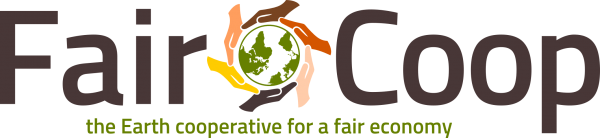

# FairTalk: Presentación de FairCoop

[FairCoop](https://fair.coop/es/): la cooperativa de la Tierra para la equidad económica.

La FairCoop es una cooperativa abierta de ámbito mundial que se autoorganiza a través de Internet fuera de los límites y controles de los estados-nación.

Su objetivo es contribuir a hacer posible la transición a un nuevo mundo reduciendo, tanto como sea posible, las desigualdades económicas y sociales entre los seres humanos y al mismo tiempo ir contribuyendo a una nueva riqueza global accesible a toda la humanidad en forma de procomún.

La FairCoop entiende que la transformación hacia un sistema monetario más justo es un elemento clave en su camino; por este motivo, apuesta por Faircoin como criptomoneda en la cual basar sus acciones de redistribución de recursos y construcción de un nuevo sistema económico global.

# Fecha

a definir (septiembre?)

# Lugar

La presentación será transmitida por Internet. Toda persona interesada podrá acceder libremente al evento.

# Agenda

1) descentralización, P2P criptomoneda, economía social, sistema monetario, construcción de alternativas, formas de organización on line. (45 min)
2) ronda de preguntas (15 min)
3) recreo (15 min)
4) workshop: descarga y uso del monedero en android, envío de faircoins (? min)

# Organizan

[Cátedra Libre de Nuevas Economías (UNLP)](https://clineunlp.wordpress.com), Dir. Pablo Gustavo Rodriguez

[Cátedra Abierta Florial Gorini, Economía Popular y Solidaria (UNRC)](https://caflorealgorini.blogspot.com), Dir. Luis Barovero

# Coordinan

Marohf, FairCoop.

Pablo Gustavo Rodriguez, Facultad de Ciencias Naturales y Museo, UNLP.

Daniel Bellomo, Facultad de Ciencias Económicas, UNRC.

# Referencias

[Introducción a FairCoop](https://vimeo.com/106546184)

[el Faircoin y un sistema económico justo](https://vimeo.com/109907239)

[FairCoop en un vistazo](https://fair.coop/es/faircoop-en-un-vistazo)

["Faircoop: La cooperativa de la tierra para la equidad económica" por Pablo Gómez Prieto](https://www.youtube.com/watch?v=HPsRgt-Oo38)

